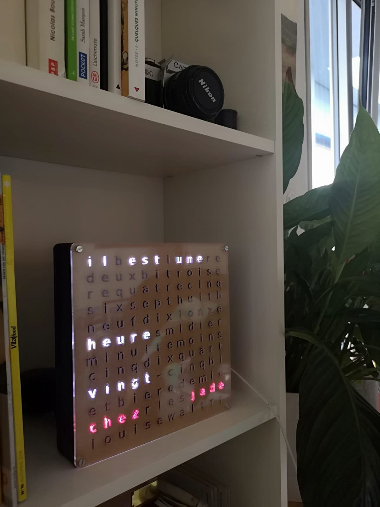

# Wordclock
Code for yet another wordclock, that one isn't generic though.
Made as a gift for friends, it holds names and specifics... Anyhow, feel free to contact me in case you'd like to use the code and need help.

## Assembly
You can find the SVG files I designed for the wood and plexiglas parts in the laserCut directory.
Watch out, the dimensions are not set, so you need to set them within the laser-cutter software.

### Parts list
* Arduino Leonardo
* LedStrip : I used [this one](https://www.aliexpress.com/snapshot/0.html?spm=a2g0s.9042647.6.2.WLVHRD&orderId=81806470273053&productId=1592593512)
* Real Time Clock : [Seed Studio RTC](http://wiki.seeedstudio.com/Grove-RTC/)
* ...

## Dependencies
The Arduino code is self-contained in the code directory.
You just need the Arduino IDE and the Pololuled library.

## Ackowledgment
Thanks a lot to the [***FabLab*** in Neuchatel](http://fablab-neuch.ch/) for their most precious help.

## License

See the [LICENSE](https://github.com/cjaques/wordclock/blob/master/LICENSE) file, MIT license. Basically you are free to use everything in this repo as much as you want, as long as you respect copyright and know that all you are finding here comes as is and with no warranty.